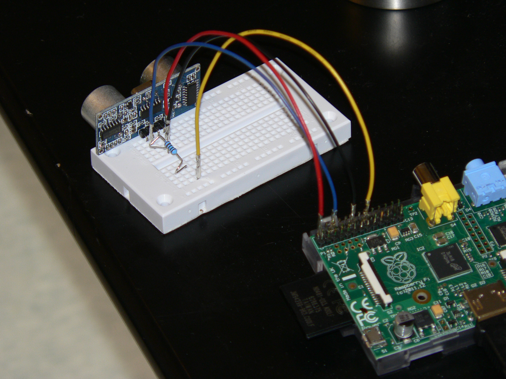

# python-ultrasonic

Ultrasonic distance meter written in Python.

To be able simulate our project, you need to have a Raspberry Pi, a breadboard, jump cables and the HC-SR04 ultrasonic ranger.
 Attatched you will find a picture of the final connection. As the code suggests, use GPIO pin 18 for output and GPIO pin 23 for input.

You need to transfer the Python file to your Raspberry Pi. We used SCP. The normal UI.py file has comments about the program's execution in Finnish. During testing we found that the comments distrupted the execution of the code so another version without comments was created for demonstrating purposes.

For a description of the project in Finnish, see the PDF file found in this repository.

